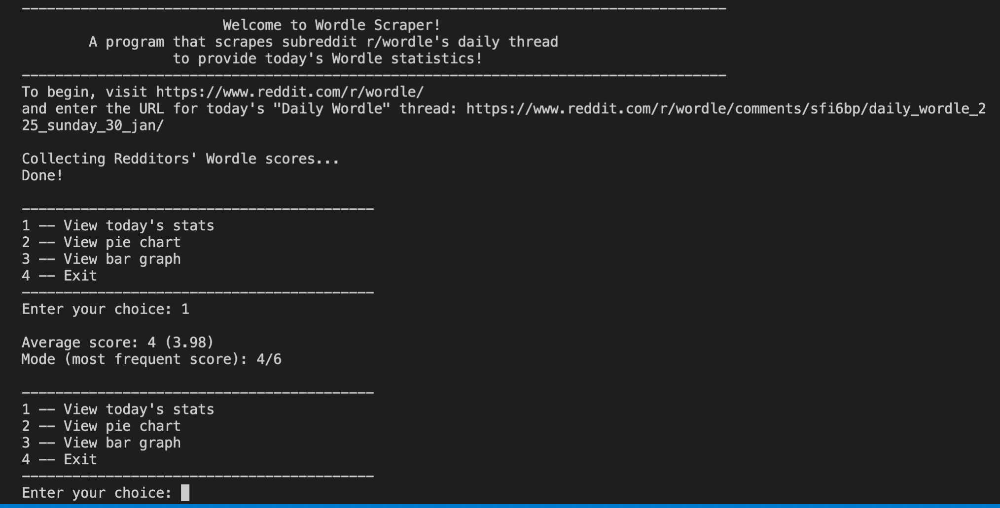
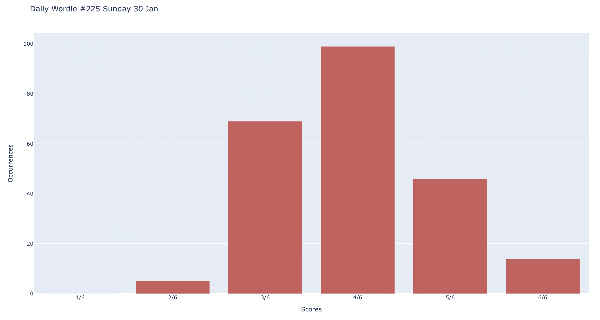
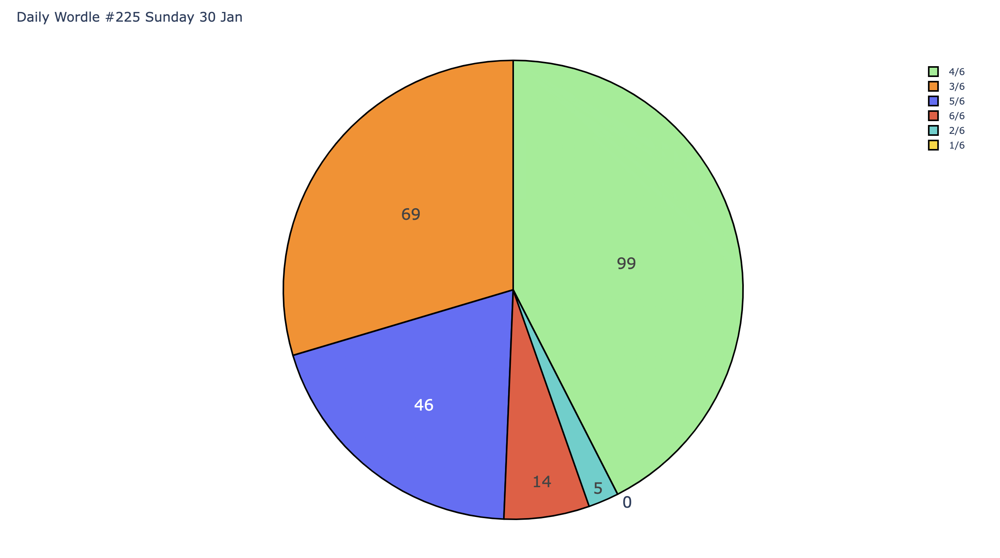

# wordle-scraper

Scrapes the subreddit r/wordle 's "Daily Wordle" posts for Redditors' Wordle scores. Displays data such as average, mode, pie chart, and bar graph through a console menu.

## General Information
- Web scraper that parses score data from a Reddit thread to display statistics
- Python 3
- Utilizes PRAW (Python Reddit API Wrapper), pandas, and plotly

## Features
- Console menu that is navigated by user
- View calculated average and mode from Wordle scores parsed from user-inputted url
- See pie chart and bar graph of data in a window
- Pulls reddit application client ID/secret from local environment variables

## Content

## License
This project is open source and available under the MIT License.
